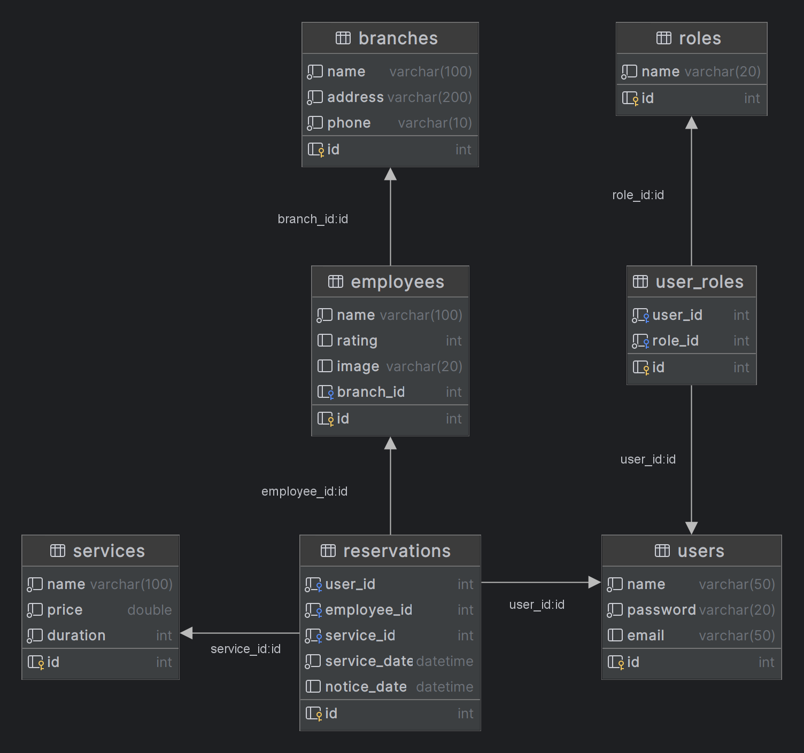

# Дипломная работа

## Booking Service

### Прототип сервиса для онлайн-записи на какую-либо услугу (например, в салоне красоты).

#### 1. Используемые технологии

Проект построен на фреймворке Spring, в частности использованы: 
* Spring Boot
* Spring Security
* Spring Data JPA
* H2 Database
* Thymeleaf
* Lombok

#### 2. Система безопасности
Система безопасности построена на Spring Security.
Предусмотрены 3 роли:
* Администратор (ADMIN)
* Менеджер (MANAGER)
* Клиент (CLIENT)

Часть ресурсов системы доступна всем пользователям (в том числе незарегистрированным). Например, просмотр списка салонов, списка мастеров и прейскуранта на услуги.

Отдельные ресурсы доступны только пользователям с определенной ролью.
Например, онлайн-бронирование доступно только клиентам, а просмотр и редактирование всех бронирований - только менеджерам.

#### 3. Система хранения данных

В демонстрационных целях в качестве СУБД выбрана H2 Database.

Ниже представлена ER-диаграмма (ERD) использованной БД:
